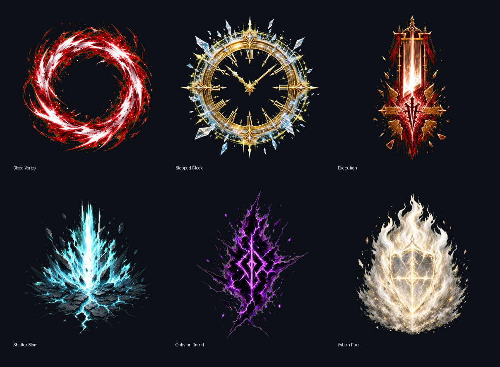

# 2026-07-22-01 - 혈반 반복 표시 수정과 남은 잔향 VFX 방향

## 1. 현재 빌드 상태

`Dev_Prototype_v1`에서 혈반 잔향이 처음 한 번만 보이는 것처럼 느껴지던 문제를 수정했다. C# 빌드, Unity 컴파일, 대검/쌍검 Echo Matrix, Dense Dual Blades Perf Matrix가 통과했다.

## 2. 오늘 바뀐 것

- 대검 혈반:
  - 기본 대검 타격이 적을 먼저 죽여도 혈반 소환 VFX가 나오도록 바꿨다.
  - 이미 죽은 대상 기준 혈반은 VFX-only로 처리해서 다른 잔향 QA 대상을 과하게 죽이지 않게 했다.
- 쌍검 혈반:
  - dense 상황에서도 첫 허용 타격마다 작은 혈반 표식 VFX가 반복해서 보이게 했다.
  - 빨간 pulse, 짧은 봉합 베기 2개, +5 bloom hint를 추가했다.
- 남은 잔향/궁극 방향:
  - 잿빛은 저장된 방어/방패 파괴/반격 충격.
  - 망각은 낙인 확산/void 균열/삭제.
  - 궁극 잔향은 일반 잔향보다 더 큰 화면 장악, 정지감, 후폭풍을 가져야 한다.

## 3. VFX 예시

- 좌상단: 잿빛 - 흰 방패판이 깨지고 반격 파동이 나가는 느낌.
- 우상단: 망각 - 보라 낙인이 바닥을 깨고 void 조각으로 지워지는 느낌.
- 좌하단: 궁극 혈반 기준 - 일반 혈반보다 더 붉고 흰 칼날 폭풍과 중앙 폭발.
- 우하단: 정지 궁극 기준 - 거대한 금색 시계와 다중 초침, 얼어붙은 파편, 빛 폭발.

## 4. 테스트 결과와 근거

- `dotnet build LETHE/Assembly-CSharp.csproj --nologo`: 통과, 기존 legacy warning 7개, 오류 0개.
- `dotnet build LETHE/Assembly-CSharp-Editor.csproj --nologo`: 통과, 기존 legacy warning 7개, 오류 0개.
- Unity compilation errors: `0`.
- Unity console errors after final QA: `0`.
- `LETHE/V1 QA/Echo Matrix Greatsword`: PASS, `total=991`, `B=303`, `stateH=1`, `stateSt=20`.
- `LETHE/V1 QA/Echo Matrix Dual Blades`: PASS, `total=1027`, `B=83`, `state=86`.
- `LETHE/V1 QA/Dense Dual Blades Perf Matrix`: PASS, `transient=46`, `activeVfx=33`, `ms=91.56`.

## 5. 결정한 것

남은 일반 잔향은 잿빛과 망각을 먼저 리워크한다. 일반 잔향 기준이 올라간 뒤, 궁극 잔향은 별도 도파민 패스로 더 강한 연출을 가진다.

## 6. 문제 또는 리스크

자동 QA는 혈반 VFX가 반복 생성되는지와 성능 예산을 확인했다. 하지만 실제 플레이에서 혈반이 정말 처음 한 번만이 아니라 반복 보상처럼 느껴지는지는 직접 플레이로 확인해야 한다.

## 7. GPT/Claude 인계 요약

Blood Echo visibility regression was fixed. Greatsword Blood now spawns VFX even on kill hits, but dead-target Blood is VFX-only. Dense Dual Blades now gets a lightweight repeated Blood mark read. Remaining normal Echo rework should target Ashen as guard/counter-pressure and Oblivion as brand spread/erase before the Ultimate Echo dopamine pass.

## 8. 다음 Codex 작업

잿빛과 망각의 콘셉트 리워크를 진행하고, 궁극 잔향은 일반 잔향보다 더 큰 의식감과 폭발감을 주는 방향으로 올린다.

## 9. 포트폴리오 메모: 문제, 방향, 행동, 결과

- 문제: 혈반이 반복 보상처럼 보이지 않고 처음 한 번만 보이는 체감이 있었다.
- 방향: 처치 타이밍과 dense 상황에서도 최소한의 반복 VFX를 보장한다.
- 행동: 대검 처치-hit VFX-only 혈반, 쌍검 dense 경량 혈반 표식을 추가하고 남은 잔향 VFX 보드를 정리했다.
- 결과: 자동 QA는 dense 성능 예산을 통과했고, 다음 리워크 순서가 잿빛 -> 망각 -> 궁극 도파민 패스로 정리됐다.

# 2026-07-22-02 - 기억/잔향/궁극 잔향 도파민 리워크

## 1. 현재 빌드 상태

`Dev_Prototype_v1`에 기억, 일반 잔향, 궁극 잔향의 뽕맛 강화 패스를 적용했다. C# 빌드, Unity 컴파일, 잔향/기억/궁극 QA, Dense Dual Blades 성능 QA가 모두 통과했다.

## 2. 오늘 바뀐 것

- 잿빛 방패:
  - 기억은 플레이어 주변에 금 간 방패판/후광이 떠서 저장된 방어로 보이게 했다.
  - 잔향은 방패가 깨지며 반격하는 레이어를 추가했다. 쌍검은 빠른 패링 컷, 대검은 방패벽 충격파 쪽이다.
- 망각 낙인:
  - 기억 +5와 잔향에 void core, 낙인 링, 균열, 지워지는 조각을 추가했다.
  - 목표는 `낙인 -> 확산 -> 삭제`로 읽히게 하는 것이다.
- 궁극 잔향:
  - 피의 칼폭풍은 시작/절정에 충격 링, 백색 코어, 검 파편 폭발을 추가했다.
  - 균열 처형은 처형 전에 바닥 판결선/문장을 남긴다.
  - 정지 추적은 궁극용 시계 폭발과 초침 스냅을 추가했다.
  - 잿빛 망각은 방패판, 잿빛 벽, void 파열, 방패 붕괴를 겹치게 했다.
- 성능:
  - 첫 Dense Dual Blades QA는 장식 VFX가 너무 쌓여 실패했다.
  - 밀집 쌍검에서는 잿빛/망각의 비핵심 장식 레이어를 생략하도록 바꿔 최종 PASS로 회복했다.

## 3. 테스트 결과와 근거

- `dotnet build LETHE/Assembly-CSharp.csproj --nologo`: 통과, 기존 legacy warning 7개, 오류 0개.
- `dotnet build LETHE/Assembly-CSharp-Editor.csproj --nologo`: 통과, warning 0개, 오류 0개.
- Unity compilation errors: `0`.
- Unity console errors after final QA: `0`.
- `LETHE/V1 QA/Echo Matrix Dual Blades`: PASS, `total=1028`, `A=110`, `O=146`.
- `LETHE/V1 QA/Echo Matrix Greatsword`: PASS, `total=991`, `A=120`, `O=103`.
- `LETHE/V1 QA/Passive Memory Matrix`: PASS, `blood=17`, `ash=6`, `stopped=8`, `oblivion=60`.
- `LETHE/V1 QA/Utility Ultimate Matrix Dual Blades`: PASS, `fracture=28`, `stasis=11`, `ashen=47`.
- `LETHE/V1 QA/Utility Ultimate Matrix Greatsword`: PASS, `fracture=49`, `stasis=26`, `ashen=12`.
- `LETHE/V1 QA/Dense Dual Blades Perf Matrix`: 최종 PASS, `transient=51`, `activeVfx=38`, `ms=98.03`.

## 4. 결정한 것

이번 패스의 기준은 일반 전투에서는 뽕맛을 올리고, 밀집 쌍검에서는 핵심 표식만 남기는 것이다. 궁극 잔향은 일반 잔향보다 화면 의식, 충격, 후폭풍이 더 강해야 한다.

## 5. 문제 또는 리스크

자동 QA는 스폰/성능/오류를 확인하지만, 실제로 도파민이 느껴지는지는 직접 플레이로만 판정 가능하다. 특히 궁극 잔향은 강해진 만큼 화면 소음이 생길 수 있어 알파, 지속시간, 파편 개수 튜닝 여지가 있다.

## 6. GPT/Claude 인계 요약

Memory/Echo/Ultimate dopamine rework is implemented in `V1GameManager`. Ashen now reads as guard/counter, Oblivion as brand/erase, and utility Ultimates gained stronger ceremony layers. Dense Dual initially failed from VFX overbudget, then passed after skipping non-essential Ashen/Oblivion ornament layers in dense Dual Blades.

## 7. 다음 Codex 작업

jaewoo가 직접 플레이로 각 계열을 `keep`, `tune`, `redesign` 중 하나로 판정한다. 다음 작업은 새 메커니즘 추가보다 화면 소음, 알파, 지속시간, 파편 개수 튜닝을 우선한다.

## 8. 포트폴리오 메모: 문제, 방향, 행동, 결과

- 문제: 잔향과 궁극 잔향이 같은 효과의 크기 차이처럼 보여 보상감이 약했다.
- 방향: 각 계열의 판타지를 액션 문법으로 분리했다.
- 행동: 잿빛은 방패/반격, 망각은 낙인/삭제, 궁극은 의식/충격/후폭풍으로 강화했다.
- 결과: 자동 QA와 Dense 성능 예산을 통과한 상태로 직접 플레이 감각 평가 단계에 들어갔다.

# 2026-07-22-03 - 정지장 판정과 원형 VFX 탈피 리워크

## 1. 현재 빌드 상태

`Dev_Prototype_v1`에 정지장 판정/레이어 수정과 처형, 파문, 낙인, 잿빛 기억/잔향의 1차 실루엣 리워크를 적용했다. C# 빌드와 Unity 컴파일은 통과했고, 주요 자동 QA와 직접 오브젝트 카운트 검증을 완료했다.

## 2. 오늘 바뀐 것

- 정지 잔향:
  - 장판 생성 시점에 있던 적만 멈추던 구조를 바꿔, 장판이 살아있는 동안 그 공간에 들어온 적도 짧은 freeze pulse를 계속 받게 했다.
  - 정지장/시계/돔 VFX는 `sortingOrder=12`로 내려서 맵보다 위, 몬스터보다 뒤에 보이게 했다.
  - 적 위 상태표식은 계속 몬스터보다 위에 남긴다.
- 처형:
  - 원형 플래시 대신 판결/처형 각인으로 변경했다.
  - 검은 sentence plate, 금색 sentence bar, 세로 칼날 stamp, nail core, burst cut을 조합했다.
- 파문:
  - 원형 파동 대신 위에서 지역을 내리찍는 ground slam으로 변경했다.
  - pressure slab, vertical downstroke, impact core, ground crack, lifted shard가 나오게 했다.
  - `shatter` SFX도 더 낮고 무거운 충격음 쪽으로 조정했다.
- 낙인:
  - 보라색 원 대신 찢어진 void brand glyph로 변경했다.
  - black tear, cross stroke, erased tear, lifted fragment로 삭제/붕괴 느낌을 강화했다.
- 잿빛:
  - 차가운 회색 원형 보호막보다 성스러운 재불꽃 방향으로 바꿨다.
  - white/gold flame tongue, grey ash bed, ember, guard plate/counter read를 섞었다.
- QA 보정:
  - Debug Echo Matrix에서 Hunter를 Execution보다 먼저 강제 호출하게 바꿔, 대검 처형이 먼저 적을 죽여 Hunter 상태표식이 사라지는 검증 순서 문제를 줄였다.

## 3. 테스트 결과와 근거

- `dotnet build LETHE/LETHE.sln`: 통과, 기존 legacy warning 7개, error 0개.
- Unity `Assets/Refresh`: 성공.
- Unity compilation errors: `0`.
- `LETHE/V1 QA/Passive Memory Matrix`: PASS, `blood=17`, `ash=5`, `stopped=8`, `oblivion=180`.
- `LETHE/V1 QA/Echo Matrix Dual Blades`: PASS, `total=1210`, `Ex=171`, `Sh=175`, `St=160`, `A=190`, `O=248`.
- `LETHE/V1 QA/Utility Ultimate Matrix Dual Blades`: PASS, `fracture=51`, `stasis=27`, `ashen=75`.
- `LETHE/V1 QA/Utility Ultimate Matrix Greatsword`: PASS, `fracture=80`, `stasis=43`, `ashen=53`.
- 직접 `DebugRunEchoMatrix(Greatsword)` 호출 후 카운트: `total=1240`, `execution=176`, `shatter=144`, `stoppedFields=433`, `ashen=424`, `oblivion=472`.
- 정지장 리플렉션/레이어 확인: `activeStoppedFields=8`, 필드/시계 샘플은 `sortingOrder=12`, 적 상태표식은 `52`.

## 4. 결정한 것

원형 장판은 앞으로 기본 표현이 아니라 보조 표현으로만 쓴다. 기억/잔향의 주 표현은 각자의 행동 실루엣으로 분리한다: 정지는 시계장, 처형은 판결 각인, 파문은 지면 내려찍기, 낙인은 찢어진 삭제문양, 잿빛은 성스러운 재불꽃.

## 5. 문제 또는 리스크

MCP `unity_execute_menu_item`와 일부 `unity_execute_code` 호출이 간헐적으로 `Error polling queue: fetch failed`를 반환했다. Unity 콘솔과 직접 매니저 호출로 실행 결과는 확인했지만, 대검 Echo Matrix 메뉴 판정은 타이밍 오염이 있어 직접 오브젝트 카운트를 근거로 남겼다. 최종 평가는 직접 플레이에서 scale, noise, timing을 봐야 한다.

## 6. GPT/Claude 인계 요약

Stopped Second now keeps active gameplay fields that freeze enemies entering during the field lifetime and renders field/clock VFX behind monsters. Execution, Shatter, Oblivion, and Ashen were reworked away from generic ring reads into judgement stamps, ground slams, torn void brands, and holy ash fire. Automated compile and most QA passed; Greatsword Echo Matrix should be judged with direct object counts or a clean runner due MCP polling/timing instability.

## 7. 다음 Codex 작업

jaewoo 직접 플레이로 각 계열을 `keep`, `tune`, `redesign`으로 판정한다. 특히 정지장은 새로 들어온 적이 멈추는지, 장판이 몬스터 뒤에서 잘 읽히는지, 처형/파문/낙인/잿빛이 더 이상 원 놀이처럼 보이지 않는지를 확인한다.

## 8. 포트폴리오 메모: 문제, 방향, 행동, 결과

- 문제: 기능은 다른데 VFX 언어가 원형 장판으로 반복되어 개성이 약했다.
- 방향: 색/크기 차이가 아니라 사건 실루엣을 분리한다.
- 행동: 정지장 판정/레이어를 고치고, 처형/파문/낙인/잿빛의 기억/잔향 VFX를 별도 문법으로 재구성했다.
- 결과: 자동 검증과 직접 카운트에서 새 VFX 생성과 레이어가 확인됐고, 이제 직접 플레이 감각 평가 단계로 넘어갈 수 있다.

# 2026-07-22-04 - 절차형 모티브 VFX 리워크

## 1. 현재 빌드 상태

`Dev_Prototype_v1`에 승인된 실루엣 보드 기반 VFX 리워크를 적용했다. 정지, 처형, 파문, 낙인, 잿빛이 이제 원형/색상 차이보다 각자의 대표 모티브로 먼저 보이도록 바뀌었다.

## 2. 오늘 바뀐 것

- 정지: 톱니, 눈금, 시계바늘, 얼어붙은 스크래치가 들어간 금색 시계 인장 스프라이트를 절차 생성한다.
- 처형: 검은 판결 몸체, 금색 판결선, 참수 칼날, 파편으로 구성된 판결/기요틴 인장을 절차 생성한다.
- 파문: 위에서 내리찍히는 충격, 지면 그림자, 균열, 들린 파편으로 구성된 내려찍기 실루엣을 절차 생성한다.
- 낙인: 찢어진 검은 void 축, 보라색 획, 부서진 룬 조각으로 구성된 각인 실루엣을 절차 생성한다.
- 잿빛: 흰색/금색 성화, 회색 재 바닥, 불씨, 수호 십자 문양으로 구성된 성스러운 재불꽃 실루엣을 절차 생성한다.
- 기억 프리뷰, 일반 잔향, 무기별 잔향 보조 레이어, 궁극 잔향 프리뷰가 새 모티브를 1차 읽기로 사용한다.

## 3. 테스트 결과와 근거

- `dotnet build`: 루트에 솔루션/프로젝트 파일이 없어 `MSB1003`으로 해당 검증 경로는 적용 불가.
- Unity editor state: `Dev_Prototype_v1`, not playing, not compiling.
- Unity compilation errors: `0`.
- Unity console errors after Play Mode QA: `0`.
- `DebugPreviewAllUtilityVfx()` 직접 호출 성공.
- `DebugRunEchoMatrix(DualBlades)` 직접 호출 성공: 8개 잔향 `+5`, `kills=31`, `storm=True`.
- `DebugRunEchoMatrix(Greatsword)` 직접 호출 성공: 8개 잔향 `+5`, `kills=57`, `storm=True`.
- 증거:
  - `docs/orchestration/evidence/2026-07-22-memory-echo-weapon-vfx-silhouette-board.png`
  - `docs/orchestration/evidence/2026-07-22-vfx-motif-preview-slow.png`
  - `docs/orchestration/evidence/2026-07-22-vfx-motif-dual-echo-matrix.png`
  - `docs/orchestration/evidence/2026-07-22-vfx-motif-great-echo-matrix.png`

## 4. 결정한 것

앞으로 유틸리티 기억/잔향 VFX는 색과 크기보다 대표 행동 실루엣이 먼저 읽혀야 한다. 원, 링, 선은 필드 범위나 타이밍을 돕는 보조 언어로만 사용한다.

## 5. 문제 또는 리스크

전체 프리뷰와 Echo Matrix는 일부러 모든 잔향을 한 번에 켜기 때문에 과밀하게 보인다. 실제 조정은 새 기능을 더 넣기보다 크기, 알파, 지속시간, 파편 개수를 먼저 줄이는 쪽이 안전하다.

## 6. GPT/Claude 인계 요약

Implemented procedural motif sprites in `V1GameManager` for Stopped, Execution, Shatter, Oblivion, and Ashen. These motifs are now wired into memory previews, normal Echoes, weapon-specific Echo support, and utility Ultimate previews. Unity compile and Play Mode smoke checks passed with console errors `0`. Next review should be direct-play taste tuning, especially scale/noise/timing.

## 7. 다음 Codex 작업

jaewoo 직접 플레이로 정지, 처형, 파문, 낙인, 잿빛을 각각 `keep`, `tune`, `redesign`으로 판정한다. 과밀하면 새 메커닉을 더하지 말고 scale, alpha, lifetime, spawn count를 먼저 조정한다.

## 8. 포트폴리오 메모: 문제, 방향, 행동, 결과

- 문제: 잔향이 원형/색상/크기 차이처럼 보여 보상감과 개성이 부족했다.
- 방향: 각 잔향을 대표 실루엣과 행동 문법으로 구분한다.
- 행동: 시계 인장, 판결 인장, 지면 내려찍기, 찢어진 낙인, 성화 모티브를 절차 스프라이트로 만들고 실제 호출부에 연결했다.
- 결과: 자동 검증과 Play Mode smoke에서 오류 없이 생성되며, 다음 단계는 직접 플레이 감각 튜닝으로 좁혀졌다.
# 2026-07-22-05 - 고품질 비트맵 VFX 텍스처 적용

## 1. 현재 빌드 상태

`Dev_Prototype_v1`에 고품질 비트맵 VFX 텍스처 6종을 적용했다. 이제 혈반, 정지, 처형, 파문, 낙인, 잿빛 계열은 단순 원/절차 도형이 아니라 실제 이미지 질감이 들어간 대표 실루엣을 우선 사용한다.

## 2. 오늘 바뀐 것

- 혈반: 레퍼런스 이미지와 가까운 붉은/흰색 원형 칼날 소용돌이 텍스처를 만들고 대검 혈반 및 피의 칼폭풍에 연결했다.
- 정지: 금색 시계, 로마 숫자, 얼음 파편, 초침이 보이는 HQ 시계 텍스처를 정지 기억/잔향에 연결했다.
- 처형: 판결문/단두대/검 낙인처럼 보이는 HQ 처형 텍스처를 연결했다.
- 파문: 위에서 찍어누른 충격, 얼음빛 파편, 갈라진 지면 텍스처를 연결했다.
- 낙인: 찢어진 보라색 void 각인 텍스처를 연결했다.
- 잿빛: 성스러운 흰색/금색 재의 불꽃과 방패 실루엣 텍스처를 연결했다.
- 쌍검 정지 잔향은 반복 발동 때 화면을 너무 덮지 않도록 HQ 시계 크기와 알파를 낮췄다.

## 3. VFX 예시

## 4. 테스트 결과와 근거

- `dotnet build LETHE/Assembly-CSharp.csproj --nologo`: 통과, 기존 legacy warning 7개, error 0개.
- `dotnet build LETHE/Assembly-CSharp-Editor.csproj --nologo`: 통과, warning 0개, error 0개.
- Unity compilation errors: `0`.
- Unity console errors after Play Mode HQ QA: `0`.
- `DebugPreviewAllUtilityVfx()`: `activeSprites=768`, `hqLike=20`.
- `DebugRunEchoMatrix(DualBlades)`: 8개 잔향 `+5`, `hqLike=161`, 캡처 저장.
- `DebugRunEchoMatrix(Greatsword)`: 8개 잔향 `+5`, `hqLike=155`, 캡처 저장.
- `DebugRunDenseDualBladePerfMatrix()`: `hits=18`, `suppressed=15`, `transient=113`, `ms=25.07`.

## 5. 결정한 것

이번 패스부터 기억/잔향의 대표 이미지는 절차 도형이 아니라 HQ 비트맵 텍스처를 기준으로 잡는다. 절차 VFX는 완전히 버리지 않고 타이밍, 타격선, 보조 링처럼 게임적인 움직임을 보강하는 용도로만 둔다.

## 6. 문제 또는 리스크

이미지 품질은 올라갔지만, 모든 잔향을 동시에 터뜨리는 디버그 매트릭스에서는 화면이 과밀하다. 특히 대검 매트릭스는 궁극기급 연출들이 한 장면에 겹쳐서 실제 플레이 감각보다 훨씬 과장되어 보인다. 다음 판단은 개별 발동 상태의 직접 플레이 기준으로 해야 한다.

## 7. GPT/Claude 인계 요약

HQ bitmap VFX pass is implemented. Blood Vortex, Stopped Clock, Execution Judgement, Shatter Slam, Oblivion Brand, and Ashen Holy Fire were generated, chroma-keyed, imported as Unity sprites, and wired into `V1GameManager` memory/Echo/Ultimate motif paths. Compile and console checks passed. Next review should tune scale/alpha/lifetime per effect in direct play, not all-on debug matrices.

## 8. 다음 Codex 작업

직접 플레이로 각 효과를 `keep`, `tune`, `redesign`으로 판정한다. 우선순위는 혈반 레퍼런스 만족도, 정지 시계 판독성, 처형/파문/낙인/잿빛의 개별 실루엣 판독성, 그리고 대검/쌍검별 화면 과밀도 조절이다.

## 9. 포트폴리오 메모: 문제, 방향, 행동, 결과

- 문제: 잔향이 기능적으로는 달라도 화면에서는 낮은 퀄리티의 원/도형 조합처럼 보였다.
- 방향: 각 기억과 잔향마다 한눈에 읽히는 고품질 대표 이미지를 먼저 세우고, 절차 VFX는 보조 레이어로 낮춘다.
- 행동: 6종 HQ 텍스처를 생성, 투명화, Unity 스프라이트 임포트, 런타임 연결, Play Mode 캡처 검증까지 완료했다.
- 결과: 레퍼런스에 가까운 혈반 소용돌이와 시계/처형/파문/낙인/잿빛의 고품질 모티브가 게임 화면에 실제로 들어갔다.
# 2026-07-22-06 - 무기별 잔향 변형 VFX 패스

## 1. 현재 빌드 상태

`Dev_Prototype_v1`에서 HQ 비트맵 VFX를 기반으로 잔향별 무기 변형 레이어를 추가했다. C# 런타임/에디터 빌드와 Unity 컴파일 검증이 통과했고, 쌍검/대검 잔향 매트릭스 캡처와 Dense Dual Blades 성능 확인까지 완료했다.

## 2. 오늘 바뀐 것

- 혈반: 쌍검은 작은 쌍혈점과 바늘 절단, 대검은 큰 혈환 위 의식 척추/초승칼 이빨.
- 파문: 쌍검은 튕기듯 이어지는 파편 절단, 대검은 내려찍는 모루/지면 균열.
- 처형: 쌍검은 판결문 바코드 각인, 대검은 처형문/문틀 실루엣.
- 정지: 쌍검은 깨진 시계 파편과 쌍초침 베기, 대검은 1초 정지 공간을 감싸는 시계 감옥.
- 잿빛: 쌍검은 패링 반격선, 대검은 성당 벽/성스러운 압력.
- 망각: 쌍검은 찢긴 void 흔적, 대검은 크레이터 이빨과 붕괴 수평선.

## 3. 테스트 결과와 근거

- `dotnet build LETHE/Assembly-CSharp.csproj --nologo`: 통과, 기존 deprecation warning 7개, 오류 0개.
- `dotnet build LETHE/Assembly-CSharp-Editor.csproj --nologo`: 통과, 기존 deprecation warning 7개, 오류 0개.
- Unity compilation errors: `0`.
- `DebugRunEchoMatrix(DualBlades)`: 8개 잔향 +5, `dualMutationObjects=320`, `spriteRenderers=4124`.
- `DebugRunEchoMatrix(Greatsword)`: 8개 잔향 +5, `greatMutationObjects=240`, `spriteRenderers=3952`.
- `DebugRunDenseDualBladePerfMatrix()`: `hits=18`, `echoesSuppressed=15`, `transient=109`, `ms=27.16`.

## 4. 결정한 것

기억/잔향/궁극은 같은 계열 모티브를 공유하되, 잔향 단계에서는 반드시 무기 문법으로 다시 변형한다. 쌍검은 빠른 쌍격/연쇄/파편, 대검은 큰 의식/충격/장악 실루엣을 우선한다.

## 5. 문제 또는 리스크

디버그 매트릭스는 모든 잔향을 동시에 켜서 화면이 과밀하다. 이번 작업은 생성과 구분을 검증한 단계이고, 실제 전투에서는 알파, 크기, 지속시간, 파편 수를 직접 플레이 기준으로 더 조정해야 한다.

## 6. GPT/Claude 인계 요약

Echo VFX now inherits the HQ family motif but mutates by weapon in `V1GameManager`. Dual Blades uses small fast twin/chain marks, while Greatsword uses large committed ritual/impact/field silhouettes. Builds and Unity matrix checks passed; direct play should classify each family/weapon pair as keep/tune/redesign.

## 7. 다음 Codex 작업

직접 플레이에서 각 무기별 잔향을 개별 확인하고, 과밀하거나 잘 안 읽히는 계열부터 알파/스케일/지속시간/파편 개수를 조정한다.

## 8. 포트폴리오 메모: 문제, 방향, 행동, 결과

- 문제: HQ 이미지를 넣어도 기억과 잔향이 같은 이미지 반복처럼 보이면 보상감이 약하다.
- 방향: 계열 모티브는 유지하되 무기마다 다른 액션 문법으로 변형한다.
- 행동: 쌍검은 빠른 연쇄 장식, 대검은 큰 충격/의식 장식을 추가하고 Dense 상황은 억제했다.
- 결과: 자동 검증과 매트릭스 캡처에서 무기별 변형 레이어가 생성되는 것을 확인했다.
