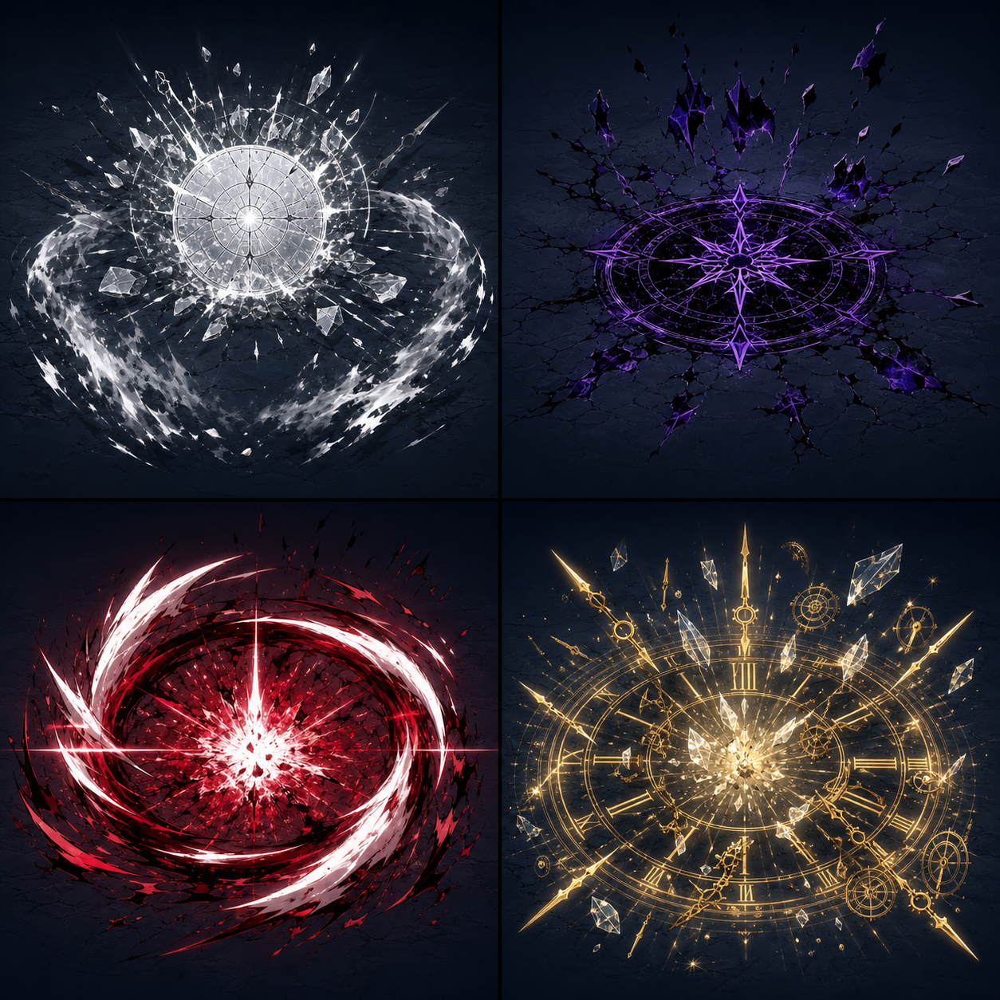

# 2026-07-22-01 - 혈반 반복 표시 수정과 남은 잔향 VFX 방향

## 1. 현재 빌드 상태

`Dev_Prototype_v1`에서 혈반 잔향이 처음 한 번만 보이는 문제를 수정했다. C# 빌드, Unity 컴파일, 대검/쌍검 Echo Matrix, Dense Dual Blades Perf Matrix가 통과했다.

## 2. 오늘 바뀐 것

- 대검 혈반:
  - 기본 대검 타격이 적을 먼저 죽여도 혈반 원환 VFX는 나오도록 바꿨다.
  - 단, 죽은 타겟 기준 혈반은 VFX-only로 처리해서 다른 잔향 QA 대상까지 과하게 죽이지 않게 했다.
- 쌍검 혈반:
  - dense 상황에서도 첫 허용 타격마다 작은 혈반 표식 VFX가 반복해서 보이게 했다.
  - 빨간 pulse, 짧은 봉합 베기 2개, +5 bloom hint를 추가했다.
- 혈반 fallback:
  - `bloodLevel < 0` 때문에 절대 실행되지 않던 죽은 분기를 제거했다.
- 남은 잔향/궁극 방향:
  - 잿빛은 저장된 방어력/반격 압력.
  - 낙인은 낙인 확산/소거.
  - 궁극 잔향은 일반 잔향보다 더 큰 화면 장악, 정지감, 후폭풍을 가져야 한다.

## 3. VFX 예시

- 좌상단: 잿빛 - 흰 재 방패판이 깨지고 반격 파동이 나가는 느낌.
- 우상단: 낙인 - 검보라 낙인이 바닥을 깨고 void 조각으로 지워지는 느낌.
- 좌하단: 궁극 혈반 기준 - 일반 혈반보다 큰 붉은/흰 칼날 원환과 중앙 폭발.
- 우하단: 정지 궁극 기준 - 거대한 금색 시계판, 다중 초침, 얼어붙은 파편, 폭발 후광.

## 4. 테스트 결과와 근거

- `dotnet build LETHE/Assembly-CSharp.csproj --nologo`: 통과, 기존 legacy warning 7개, 오류 0개.
- `dotnet build LETHE/Assembly-CSharp-Editor.csproj --nologo`: 통과, 기존 legacy warning 7개, 오류 0개.
- Unity compilation errors: `0`.
- Unity console errors after final QA: `0`.
- `LETHE/V1 QA/Echo Matrix Greatsword`: PASS, `total=991`, `B=303`, `stateH=1`, `stateSt=20`.
- `LETHE/V1 QA/Echo Matrix Dual Blades`: PASS, `total=1027`, `B=83`, `state=86`.
- `LETHE/V1 QA/Dense Dual Blades Perf Matrix`: PASS, `transient=46`, `activeVfx=33`, `ms=91.56`.

## 5. 결정한 것

남은 일반 잔향은 잿빛과 낙인을 먼저 리워크한다. 일반 잔향 기준은 이제 "보이는가"가 아니라 "한 번 터질 때 짧은 도파민 피크가 있는가"다. 궁극 잔향은 일반 잔향보다 더 큰 의식감과 후폭풍을 가져야 한다.

## 6. 문제 또는 리스크

자동 QA는 혈반 VFX가 계속 생성되는지와 성능 예산을 확인했다. 하지만 실제 플레이에서 혈반이 "처음 한 번만"으로 느껴지는 문제가 완전히 사라졌는지는 직접 플레이로 확인해야 한다.

## 7. GPT/Claude 인계 요약

Blood Echo visibility regression was fixed. Greatsword Blood now spawns VFX even on kill hits, but dead-target Blood is VFX-only. Dense Dual Blades now gets a lightweight repeated Blood mark read. Remaining normal Echo rework should target Ashen as guard/counter-pressure and Oblivion as brand spread/erase before the Ultimate Echo dopamine pass.

## 8. 다음 Codex 작업

잿빛 잔향을 먼저 리워크한다. 목표는 방패를 키우는 것이 아니라, 저장된 방어력이 깨지는 순간 반격 파동으로 바뀌는 행동을 만들고 쌍검/대검 실루엣을 나누는 것이다.

## 9. 포트폴리오 메모: 문제, 방향, 행동, 결과

- 문제: 혈반이 반복 보상처럼 보이지 않고 처음 한 번만 보이는 체감이 있었다.
- 방향: 처치타와 dense 상황에서도 최소한의 반복 VFX를 보장한다.
- 행동: 대검 처치타 VFX-only 혈반, 쌍검 dense 경량 혈반 표식을 추가하고 남은 잔향 VFX 보드를 정리했다.
- 결과: 자동 QA와 dense 성능 예산을 통과했고, 남은 리워크 순서가 잿빛 -> 낙인 -> 궁극 도파민 패스로 정리됐다.
